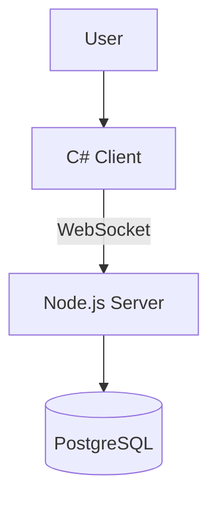

>[!NOTE]
> Privacy is the cornerstone of this project. Every contribution must prioritize user anonymity and data minimization. We do not accept features that require telemetry, invasive tracking, or the collection of personally identifiable information (PII).

    
    

[-%7BDont();%7D-brightgreen)](#)

---

# Contributing to Roblox Chat Launcher

This guide covers everything you need to start contributing: environment setup, testing, commit conventions, building the project, and submitting pull requests.

---

## 🏗️ Architecture Overview

Roblox Chat Launcher consists of:

- A C# desktop client (.NET 10)
- A Node.js backend server
- A PostgreSQL database
- An optional Windows installer (Inno Setup)

The client connects to the backend via WebSockets and REST endpoints.
The backend handles validation, session management, and database operations.

### Client (C# / .NET 10 / WinForms)

- Located in `/client`
- Entry point: `Program.cs`

#### Base URL Configuration

The backend base URL used by the client is defined in:

`Constants.cs`

Important formatting rules:

- Do not include a URI `https` or `wss`
- Do not include a colon `:`
- Do not include leading slashes `//`
- Do not include a trailing slash `/`

Example (correct):

`example.com`

Example (incorrect):

`https://example.com/`

### Server (Node.js / Express)

- Located in `/server`
- Entry point: `server.js`
- Uses Express for REST endpoints
- Uses WebSockets for real-time communication
- Requires a PostgreSQL database
- Requires a valid `DATABASE_URL` environment variable

The server will fail to start if PostgreSQL is not configured correctly.

> [!IMPORTANT]
> **Security Recommendation:**  
> PostgreSQL should not be exposed to the public internet. Only the backend server should have direct database access over a private or internal network.

### Communication Flow

User → C# Client → WebSocket/REST → Node.js Server → PostgreSQL

## 🛠️ Recommended Development Environment

To ensure your environment matches production builds:

### IDE & Toolchain

* **[Visual Studio 2026](https://visualstudio.microsoft.com/downloads/):** primary IDE; required to target .NET 10.0.
* **[.NET 10 SDK](https://dotnet.microsoft.com/en-us/download/dotnet/10.0):** the target framework for the C# client.
* **[Inno Setup 6.7+](https://jrsoftware.org/isdl.php):** for building the installer.
* **[Docker Desktop](https://www.docker.com/products/docker-desktop/):** to build images and deploy the back-end server.
* **[PostgreSQL 18+](https://www.postgresql.org/download/):** required to start the back-end server.
  * Must provide a valid `DATABASE_URL` environment variable.

### Testing & Virtualization

Use a sandboxed environment for safe testing:

* **[VirtualBox](https://www.virtualbox.org/wiki/Downloads) or any other hypervisor:** any hypervisor of choice (Type 2 virtualization is sufficient).
* **Some recommended disk images:**
  * **Windows 11:** full windows image.
    * [Download](https://www.microsoft.com/en-us/software-download/windows11)
  * **Tiny11 25H2 / Tiny11 Core 25H2:** minimal Windows 11 images.
    * [Download](https://archive.org/details/tiny11_25H2)
  * **Tiny11 Core Beta 1 (Windows 11 Pro 23H2, Build 22631.2361):** smaller minimal testing image.
    * [Download](https://archive.org/details/tiny-11-core-x-64-beta-1)

> [!CAUTION]
> **Tiny11 Core Safety Notes:**
>
> * Tiny11 Core is not a replacement for Tiny11; use for testing in a VM only.
> * Windows Defender is not included in Tiny11 Core. Exercise caution when browsing inside the VM.

---

## 💬 Commit Message Guidelines

All commits **must follow [Conventional Commits v1.0.0](https://www.conventionalcommits.org/en/v1.0.0)**.

> [!IMPORTANT]
> **Use Scopes!**
> 
> Please make sure that every commit type includes a scope indicating the part of the project affected (e.g., `client`, `server`, `installer`, `docs`).

### Examples

| Commit Message | Description |
| :--- | :--- |
| `feat(client):` add WebSocket listener for server instance IDs | Adds a new functional feature to the C# client. |
| `fix(server):` resolve memory leak in connection pooling | Fixes a bug within the Node.js/Express backend. |
| `refactor(client):` clean up input capture logic | Improving code structure without changing behavior. |
| `perf(server):` optimize message broadcasting latency | A change specifically focused on improving speed. |
| `chore(installer):` update Inno Setup script for .NET 10.0 | Routine maintenance or dependency updates. |
| `chore(docs):` add security research citations for Persona | Documentation-only changes. |

### Common Commit Types

* `feat(scope):` new feature
* `fix(scope):` bug fix
* `refactor(scope):` code changes that don’t add features or fix bugs
* `perf(scope):` performance improvements
* `chore(scope):` maintenance tasks

---

## 📥 Installing Roblox Chat Launcher from CLI in a VM

  
Click to expand

   
  

    Follow these steps to install .NET 10 and Roblox Chat Launcher 
    <strong>without Git, GitHub CLI, or a browser</strong>. 
    This guide is intended for usage in a minimal virtual machine for the purposes of testing; 
    prefer conventional methods such as <code>git clone</code> elsewhere.
  

  <h3>📥 One-Line Installation</h3>
  

    Run the following in <b>PowerShell</b> to perform all setup steps automatically, 
    including creating directories, installing .NET (Runtime or SDK), 
    and downloading Roblox Chat Launcher (source or release executable):
  

  <pre><code>iex (iwr -useb https://raw.githubusercontent.com/AlinaWan/RobloxChatLauncher/main/.github/scripts/setup_vm.ps1); setup -Mode SDK -Branch main
</code></pre>

  
<strong>Options:</strong>

  <ul>
    <li><code>-Mode Runtime</code> – installs the .NET Desktop Runtime</li>
    <li><code>-Mode SDK</code> – installs the full .NET SDK</li>
    <li><code>-Branch &lt;branch|tag|commit&gt;</code> – download a specific branch, tag, commit hash, or release tag if -UseReleaseExe</li>
    <li><code>-UseReleaseExe</code> – download the first release .exe instead of source code</li>
  </ul>

  

  
Click to see manual setup steps instead

   
  

  
    <h3>📥 Manual Installation</h3>
  <h4>1️⃣ Prepare Directories</h4>
  
Open <b>PowerShell (Admin)</b>:

  <pre><code>mkdir C:\Downloads
mkdir C:\dotnet
cd C:\Downloads</code></pre>

  

  <h4>2️⃣ Install .NET 10</h4>
  
Install .NET Desktop Runtime:

  <pre><code>Invoke-WebRequest https://dot.net/v1/dotnet-install.ps1 -OutFile C:\dotnet\dotnet-install.ps1
powershell -ExecutionPolicy Bypass -File C:\dotnet\dotnet-install.ps1 -Runtime windowsdesktop -Channel 10.0
setx PATH "$env:PATH;C:\dotnet"
dotnet --list-runtimes</code></pre>
  
You should see a <code>Microsoft.WindowsDesktop.App 10.0.x</code> entry.

    
Or .NET SDK:

  <pre><code>Invoke-WebRequest https://dot.net/v1/dotnet-install.ps1 -OutFile C:\dotnet\dotnet-install.ps1
powershell -ExecutionPolicy Bypass -File C:\dotnet\dotnet-install.ps1 -Channel 10.0
$env:PATH += ";C:\dotnet"
dotnet --info</code></pre>

  

  <h4>3️⃣ Download RobloxChatLauncher</h4>
  
Download the repository:

  <pre><code>Invoke-WebRequest -Uri "https://github.com/AlinaWan/RobloxChatLauncher/archive/refs/heads/main.zip" -OutFile "C:\Downloads\RobloxChatLauncher.zip"
Expand-Archive -Path "C:\Downloads\RobloxChatLauncher.zip" -DestinationPath "C:\Downloads\RobloxChatLauncher"</code></pre>
  
  
Or a specific tag/commit hash:

  <pre><code>Invoke-WebRequest -Uri "https://github.com/AlinaWan/RobloxChatLauncher/archive/refs/tags/v1.0.0.zip" -OutFile "C:\Downloads\RobloxChatLauncher.zip"
Invoke-WebRequest -Uri "https://github.com/AlinaWan/RobloxChatLauncher/archive/a1b2c3d.zip" -OutFile "C:\Downloads\RobloxChatLauncher.zip"
Expand-Archive -Path "C:\Downloads\RobloxChatLauncher.zip" -DestinationPath "C:\Downloads\RobloxChatLauncher"</code></pre>

  
Or the Installer.exe of a release:

  <pre><code>Invoke-WebRequest -Uri "https://github.com/AlinaWan/RobloxChatLauncher/releases/download/v1.0.0/Installer.exe" -OutFile "C:\Downloads\Installer.exe"</code></pre>

  

  
Verify that all files are available:

  <pre><code>Get-ChildItem "C:\Downloads\RobloxChatLauncher"</code></pre>
  
  
Or verify the executable exists:

  <pre><code>Test-Path "C:\Downloads\Installer.exe"</code></pre>

---

## 💻 Development Guidelines

* Follow existing code style for C# and JavaScript.
* Keep commits small, descriptive, and scoped.

---

## 📜 Pull Request Checklist

* [ ] Builds successfully.
* [ ] Commits follow Conventional Commits.
* [ ] Changes documented clearly.
* [ ] I agree that my contributions will be licensed under the **GNU GPLv3**.
