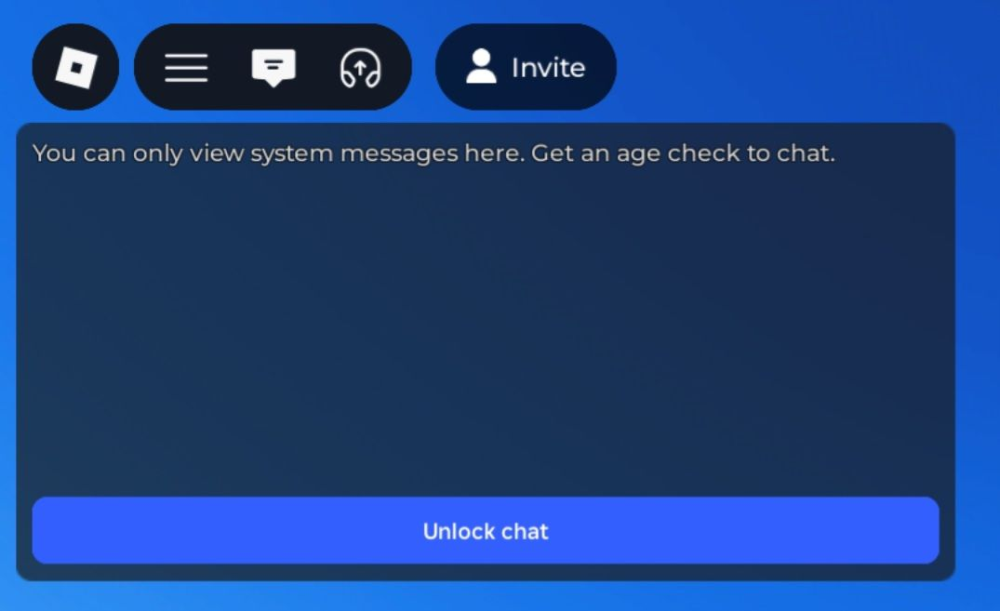

# Roblox Chat Launcher

[](LICENSE)
[](https://github.com/AlinaWan/RobloxChatLauncher/releases/latest)
[](CONTRIBUTING.md)
[](#)
[](#)
[](#)
[](#)

> [!WARNING]
> **THIS IS A PROOF OF CONCEPT**
>
> You cannot chat with anyone yet. However, the vision is to eventually exchange messages through a PaaS, using the exposed server instance ID to connect only with people in the same Roblox server.

> [!NOTE]
> A **demo server is running on Render** for proof-of-concept testing!  
> Messages you type are sent only to this server and echoed back to you.  
> **No other users receive your messages** — this is purely for testing the chat overlay functionality.

[](https://github.com/AlinaWan/RobloxChatLauncher/stargazers)

**A lightweight Windows utility designed to restore and modernize the Roblox social experience.**

Why?

As of January 7, 2026, Roblox has completely removed in-game communication unless users provide pictures of their face or government IDs—sensitive information that becomes a major security liability in the event of a data breach. While Roblox claims to "immediately" delete this data after processing it, [Roblox's partner Persona can keep copies for up to 30 days](https://en.help.roblox.com/hc/en-us/articles/4412863575316-Roblox-Facial-Media-Capture-Privacy-Notice#:~:text=Our%20service%20provider%2C%20Persona%2C%20will%20respectively%20delete%20your%20Biometric%20Data%20within%2030%20days%20after%20collection%2C%20unless%20required%20by%20law%20(such%20as%20a%20warrant%20or%20subpoena)%20to%20keep%20your%20Biometric%20Data%20for%20a%20longer%20period.).

Furthermore, new age-group filtering often fragments the player base and ruins the cooperative experience. The Roblox Chat Launcher restores this lost social layer with a lightweight Windows overlay that mirrors the native chat experience. By using your keyboard's existing muscle memory and synchronizing directly with the Roblox window, it provides a secure, native-feeling alternative that keeps communication open and co-op gameplay intact without the privacy risks.



---

<!-- npx doctoc README.md --maxlevel 3 -->
<!-- START doctoc generated TOC please keep comment here to allow auto update -->
<!-- DON'T EDIT THIS SECTION, INSTEAD RE-RUN doctoc TO UPDATE -->
**Table of Contents**  *generated with [DocToc](https://github.com/thlorenz/doctoc)*

- [Why Not Just Use Discord?](#why-not-just-use-discord)
- [Features](#features)
- [Technical Overview (Proof of Concept)](#technical-overview-proof-of-concept)
  - [What the PoC Does](#what-the-poc-does)
  - [What the PoC Does **Not** Do](#what-the-poc-does-not-do)
  - [Input Handling Details](#input-handling-details)
  - [Passthrough Input](#passthrough-input)
  - [Overlay Opacity & Fade](#overlay-opacity--fade)
  - [Registry Modification](#registry-modification)
  - [Future Architecture (Planned)](#future-architecture-planned)
- [Prerequisites](#prerequisites)
- [Installation](#installation)
- [First Run (Important)](#first-run-important)
- [Usage](#usage)
- [Contributing & Feedback](#contributing--feedback)
  - [How You Can Help](#how-you-can-help)
  - [Content Creators](#content-creators)
- [License](#license)

<!-- END doctoc generated TOC please keep comment here to allow auto update -->

---

## Why Not Just Use Discord?

The most common objection is: "But both people need to download this to talk—why not just use Discord?" While Discord is great for pre-planned groups, it fails the spontaneous player. This launcher isn't just a Discord alternative; it’s a native-feel bypass that solves the "Stranger Friction" Discord can't touch.

1. **Zero-Friction Connection (No "Add Me" Required)**  
On Discord, you often need to stop playing, find a Discord server for the game, locate your teammates, and join a channel. This creates friction and interrupts gameplay. It also requires the game to have, well... a Discord server.

   **The Launcher Way:** It uses your Server Instance ID to automatically put you in a room with everyone else in your game who has the app. No links, no multiple servers, no friction. You just join the game and start typing.

2. **Context-Aware Intelligence**  
Discord is a global "everything" app. This is a precision tool for the game you are currently playing.

   **Automatic Filtering:** You only hear from people in your specific server. When you hop to a new game, the chat channel hops with you. You never have to manually switch "servers" or "channels" to keep up with your current teammates.

3. **Integrated "Native" Ergonomics**  
Using Discord involves a clunky overlay or constant Alt-Tabbing, which can cause Roblox to lag or crash.

   **Seamless Input:** This launcher mirrors the native Roblox experience. Pressing / to start and Enter to send works exactly like the original chat. You never unfocus Roblox, allowing you to stay focused on the game while using a modern, unrestricted UI.

4. **Reliable Communication in an "Age-Restricted" Era**  
As Roblox moves toward Facial Age Estimation and restricted chat categories, many players are losing the ability to communicate effectively in-game.

   This project provides a consistent, high-performance communication layer that bypasses UI limitations while remaining 100% compliant with Roblox’s Terms of Service (no injection or memory tampering).

---

## Features

* Passthrough input: You do not have to unfocus Roblox to type; pressing `/` and `Enter` is captured and lets you type like native chat
* Synchronizes minimized/restored state with the Roblox window
* No Roblox injection or memory modification

---

## Technical Overview (Proof of Concept)

This project is a **proof of concept**. Its goal is to demonstrate the **feasibility** of a lightweight, **native-feel** Roblox chat overlay as a **bypass** for communication being removed or restricted, not to provide a complete networking system.  

### What the PoC Does

* Registers itself as the `roblox-player:` URI handler so launching Roblox also opens the chat overlay.
* Launches Roblox without modifying the game or its files.
* Displays a topmost WinForms chat window that overlays Roblox.
* Captures keyboard input globally to replicate native Roblox chat behavior (`/` to start typing, `Enter` to send).
* Synchronizes the overlay’s visibility with the Roblox window (minimized/restored state).
* Implements a custom-painted input box with a blinking caret for a native-feel typing experience.
* Sends your message to a real PaaS server and echoes it back to you for demo purposes.

### What the PoC Does **Not** Do

* ❌ No Roblox injection or memory modification.
* ❌ No reading or manipulating Roblox process memory.
* ❌ No network traffic interception.
* ❌ No live multiplayer networking yet (messages are only sent to the demo server for POC testing and echoed back to you).
* ❌ No persistent user accounts or data tracking.

### Input Handling Details

* Uses [`Gma.System.MouseKeyHook`](https://www.nuget.org/packages/MouseKeyHook/) for a global keyboard hook.
* Converts keys into text using `ToUnicodeEx` for layout-correct, shift-aware input.
* Ensures a seamless typing experience while the game is running.

### Passthrough Input

One of the key design choices in this PoC is **passthrough input**, meaning you can type in the chat overlay without ever having to focus it, then continue playing Roblox seamlessly.  

* Traditional overlays require you to click or focus the input box, type your message, press Enter, and then manually return focus to the game. This interrupts gameplay, risks mis-clicks, and can cause lag or unintended inputs.  
* The launcher captures keyboard input globally, mirrors it in the overlay, and sends it to a **demo server running on Render**, which echoes the message back for testing purposes. Messages are **never sent to any other user**, only to the server and back to you. 
* This preserves **muscle memory** and the natural feel of Roblox’s native chat: `/` to start, `Enter` to send, and you never leave the game window.  

Because the overlay never receives focus, the **Win32 caret is hidden** and a **custom "fake" caret** is drawn inside the input box to indicate typing. This allows the overlay to remain fully non-intrusive while still giving visual feedback exactly like Roblox’s native chat.

### Overlay Opacity & Fade

The chat overlay adjusts its **opacity dynamically** to indicate its current state:

* When chat input is active (after pressing `/`), the overlay becomes fully opaque so typing is clear and readable.
* When idle, the overlay is semi-transparent (default ~70%) to remain unobtrusive while you play.
* Opacity changes are **smoothly animated**, providing a natural fade in/out rather than an abrupt jump, which mimics native UI behavior and keeps focus on the game.

This design complements passthrough input and the fake caret, creating a seamless, non-intrusive chat experience that feels integrated with Roblox itself.

### Registry Modification

* Updates `HKEY_CLASSES_ROOT\roblox-player\shell\open\command` to point to this launcher on first run.
* This allows Roblox to launch the chat overlay automatically.
* Can be reverted by reinstalling Roblox or restoring the key to `RobloxPlayerBeta.exe`.

### Future Architecture (Planned)

* Messages will eventually synchronize through a stateless relay or PaaS.
* Server Instance ID will ensure chat is scoped only to players in the same Roblox server.
* No friend lists, no persistent identifiers — communication will remain ephemeral.

#### Preventing Abuse and Ensuring Data Integrity

To maintain stability and prevent malicious use:

* **Message Validation:**

  * Only allow messages of the expected type (text).
  * Enforce maximum message size to prevent huge payloads.
  * Reject invalid or malformed messages before storing or broadcasting.
  * Filter messages for illegal or harmful content using an API (may allow profanities based on user preference).
  * Implement rate limiting to prevent spamming.

* **Network-Level Protections:**

  * Integrate with PaaS or cloud provider features (e.g., Cloudflare) to mitigate DoS/DDoS attacks (IP throttling, connection limits, firewall rules).
  * Optionally include CAPTCHA or lightweight proof-of-work token issuance to make automated attacks expensive.

---

## Prerequisites

* Windows 10 or newer
* Roblox installed on the system
* [.NET 10.0 SDK](https://dotnet.microsoft.com/en-us/download/dotnet/thank-you/sdk-10.0.101-windows-x64-installer) (To build and run the app)
* [.NET 10.0 Desktop Runtime](https://dotnet.microsoft.com/en-us/download/dotnet/thank-you/runtime-desktop-10.0.1-windows-x64-installer) (To run the app only)

---

## Installation

Clone the repository:

```powershell
git clone https://github.com/AlinaWan/RobloxChatLauncher
cd RobloxChatLauncher
```

The project already references [**Gma.System.MouseKeyHook**](https://www.nuget.org/packages/MouseKeyHook/) and [**Newtonsoft.Json**](https://www.nuget.org/packages/newtonsoft.json/) in the `.csproj`, but if you need to install them manually, the commands are:

```powershell
dotnet add package MouseKeyHook --version 5.7.1
dotnet add package Newtonsoft.Json --version 13.0.4
```

---

## First Run (Important)

On the **first run only**, you must execute the app once so it can update the Windows registry to associate Roblox chat handling with this application.

Run:

```powershell
dotnet run
```

> [!WARNING]
>
> This will automatically change the registry key without a confirmation. To revert back to the original Roblox launcher, you can re-run the `RobloxPlayerInstaller` or manually change the key value to `RobloxPlayerBeta.exe`'s path.  
> Only the `HKEY_CLASSES_ROOT\roblox-player\shell\open\command` key is changed.

This step switches the relevant Roblox registry key to point to the launcher. After this, launching Roblox will automatically launch the chat window alongside the client.

---

## Usage

1. Launch Roblox normally
2. The chat window will activate
3. Type as usual, pressing `/` to start typing and `Enter` to send

> [!NOTE]
>
> Your message is sent to a demo server running on Render and it gets echoed back to you for POC demo testing.  
> Messages are **never sent to any other user**, only to the server and back to you.

---

## Contributing & Feedback

This project is an early **proof of concept**. Contributions and feedback are highly appreciated — every bit helps improve usability, polish the overlay, and inform future development.

### How You Can Help

* **Report bugs or UX issues** — let us know if the overlay behaves unexpectedly, or if passthrough input, fake caret, or opacity/fade feel off.  
* **Suggest improvements** — ideas for smoother animations, input handling, or overlay ergonomics are welcome.  
* **Documentation & demos** — help make it easier for others to try the launcher safely.  
* **Code contributions** — small fixes, refactoring, or enhancements to the PoC are appreciated, but the project is still early, so focus on safe, non-invasive improvements.

### Content Creators

If you’re a content creator, your **feedback and exposure** can help the project grow while addressing a problem many Roblox players are frustrated with: the new age-based chat restrictions and privacy requirements.  

Sharing your experience, creating a demo, or reporting insights can:

* Help refine the launcher’s usability and design  
* Provide players with a safe, privacy-friendly way to communicate in-game  
* Bring attention to the challenges introduced by Roblox’s recent changes  

Even small contributions or observations are valuable at this stage — your input helps shape the project and its future development.

---

## License

[GNU General Public License v3.0](LICENSE)

## Privacy Policy
[Privacy Policy](PRIVACY)
