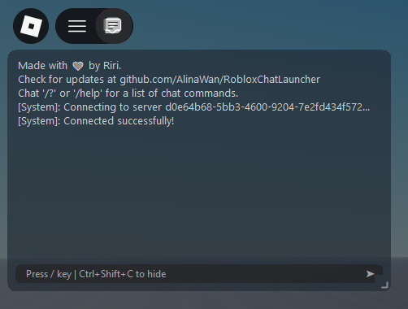
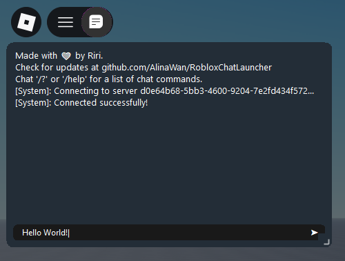

> [!CAUTION]
> The only official place to download Roblox Chat Launcher is [this GitHub repository](https://github.com/AlinaWan/RobloxChatLauncher). Any other websites offering downloads or claiming to be us are not owned by us.

<p align="center">
    
    
</p>

<!--
<div align="center">
  <h1>Roblox Chat Launcher</h1>
</div>
-->

<div align="center">
  
[](LICENSE)
[](https://github.com/AlinaWan/RobloxChatLauncher/releases/latest)
[](CONTRIBUTING.md)
[](#)
[](#)
[](#)
[](#)
[](#)

</div>

<div align="center">
  
[](https://github.com/AlinaWan/RobloxChatLauncher/stargazers)
[](https://github.com/AlinaWan/RobloxChatLauncher/releases)

</div>


----

A proof-of-concept launcher designed to restore and modernize the Roblox social experience because Roblox is removing in-game communication unless users provide pictures of their face or government IDs.

<!-- Preview images start -->
<p align="center">
  
  
</p>
<!-- Preview images end -->

Why?

As of January 7, 2026, Roblox has completely removed in-game communication unless users provide pictures of their face or government IDs—sensitive information that becomes a major security liability in the event of a data breach. While Roblox claims to "immediately" delete this data after processing it, [Roblox's partner Persona can keep copies for up to 30 days](https://en.help.roblox.com/hc/en-us/articles/4412863575316-Roblox-Facial-Media-Capture-Privacy-Notice#:~:text=Our%20service%20provider%2C%20Persona%2C%20will%20respectively%20delete%20your%20Biometric%20Data%20within%2030%20days%20after%20collection%2C%20unless%20required%20by%20law%20(such%20as%20a%20warrant%20or%20subpoena)%20to%20keep%20your%20Biometric%20Data%20for%20a%20longer%20period.).

Furthermore, new age-group filtering often fragments the player base and ruins the cooperative experience. The Roblox Chat Launcher restores this lost social layer with a lightweight Windows overlay that mirrors the native chat experience. By using your keyboard's existing muscle memory and synchronizing directly with the Roblox window, it provides a secure, native-feeling alternative that keeps communication open and co-op gameplay intact without the privacy risks.

<p align="center">
  
</p>

Roblox Chat Launcher is only supported for PCs running Windows.

---

<!-- START doctoc generated TOC please keep comment here to allow auto update -->
<!-- DON'T EDIT THIS SECTION, INSTEAD RE-RUN doctoc TO UPDATE -->

- [❓ Frequently Asked Questions](#-frequently-asked-questions)
- [💬 Why Not Just Use Discord?](#-why-not-just-use-discord)
- [📋 Features](#-features)
- [🌐 Installing](#-installing)
- [📦 Compiling from Source](#-compiling-from-source)
  - [Client (C#)](#client-c)
  - [Server (Docker)](#server-docker)
  - [Installer (Inno Setup)](#installer-inno-setup)
- [Trust & Provenance](#trust--provenance)
  - [Verify with GitHub CLI](#verify-with-github-cli)
  - [Verify with Cosign](#verify-with-cosign)
- [Terms of Service](#terms-of-service)
- [Privacy Policy](#privacy-policy)
- [License](#license)
- [Acknowledgements](#acknowledgements)

<!-- END doctoc generated TOC please keep comment here to allow auto update -->

---

## ❓ Frequently Asked Questions

**Q: Is this malware?**

**A:** No. The source code here is viewable to all, and it'd be impossible for us to slip anything malicious into the downloads without anyone noticing. Just be sure you're downloading it from [this GitHub repository](https://github.com/AlinaWan/RobloxChatLauncher).

**Want to be 100% sure?** Every release is cryptographically signed and attested. You can verify that the `.exe` you downloaded exactly matches the code in this repo by following the [Verification Guide](#trust--provenance).

**Q: Can using this get me banned?**

**A:** No, it shouldn't. Like other bootstrappers, Roblox Chat Launcher doesn't interact with the Roblox client in the same way that exploits do. Think of the chat window like using a messaging app like Discord, only seamlessly integrated with the native Roblox experience.

## 💬 Why Not Just Use Discord?

The most common objection is: "But both people need to download this to talk—why not just use Discord?" While Discord is great for pre-planned groups, it fails the spontaneous player. This launcher isn't just a Discord alternative; it’s a native-feel bypass that solves the "Stranger Friction" Discord can't touch.

1. **Zero-Friction Connection (No "Add Me" Required)**  
On Discord, you need to stop playing, find a Discord server for the game, locate your teammates (and hope they're in the game's Discord server), and join a channel. This creates friction and interrupts gameplay. It also requires the game to have, well... a Discord server.

   **The Launcher Way:** It uses your Server Instance ID as a channel via WebSockets to automatically put you in a room with everyone else in your game who has the app. No links, no multiple servers, no friction. You just join the game and start typing, and people in your Roblox server see your messages in real time.
   
3. **Context-Aware Intelligence**  
Discord is a global "everything" app. This is a precision tool for the game you are currently playing.

   **Automatic Filtering:** You only hear from people in your specific server. When you hop to a new game, the chat channel hops with you. You never have to manually switch "servers" or "channels" to keep up with your current teammates.

4. **Integrated "Native" Ergonomics**  
Using Discord involves a clunky overlay or constant Alt-Tabbing, which can cause Roblox to lag or crash.

   **Seamless Input:** This launcher mirrors the native Roblox experience. Pressing / to start and Enter to send works exactly like the original chat. You never unfocus Roblox, allowing you to stay focused on the game while using a modern UI.

5. **Reliable Communication in an "Age-Restricted" Era**  
As Roblox moves toward Facial Age Estimation and restricted chat categories, many players are losing the ability to communicate effectively in-game.

   This project provides a consistent, high-performance communication layer that bypasses UI limitations while remaining 100% compliant with Roblox's Terms of Service (no injection or memory tampering).

## 📋 Features

* Multi-user chat via WebSockets scoped to your Roblox server instance
* Passthrough input: You do not have to unfocus Roblox to type; pressing `/` and `Enter` is captured and lets you type like native chat
* Synchronizes minimized/restored state with the Roblox window
* Absolutely no Roblox injection or memory modification
* Server-side moderation, rate limiting, and queue management
* Compatible with your favorite Roblox bootstrappers

## 🌐 Installing
Download the [latest release of Roblox Chat Launcher](https://github.com/AlinaWan/RobloxChatLauncher/releases), and run the installer. After installation, launching a game will automatically launch the chat window alongside it.

You will also need the [.NET 10.0 Desktop Runtime](https://dotnet.microsoft.com/en-us/download/dotnet/thank-you/runtime-desktop-10.0.1-windows-x64-installer). If you don't already have it installed, you'll be prompted to install it anyway. Be sure to install Roblox Chat Launcher after you've installed this.

It's not unlikely that Windows Smartscreen will show a popup when you run Roblox Chat Launcher for the first time. This happens because it's an unknown program, not because it's actually detected as being malicious. To dismiss it, just click on "More info" and then "Run anyway".

Roblox Chat Launcher can be easily uninstalled simply by running the original `RobloxPlayerInstaller.exe`, which will register itself as the main launch command for Roblox again.

## 📦 Compiling from Source

First things first, clone the repository and navigate to the root folder:

```powershell
git clone https://github.com/AlinaWan/RobloxChatLauncher
cd RobloxChatLauncher
```

<!-- Client -->
<details>
  <summary>Client (C#)</summary>

### Client (C#)
  
#### Prerequisites

* [.NET 10.0 SDK](https://dotnet.microsoft.com/en-us/download/dotnet/thank-you/sdk-10.0.101-windows-x64-installer)

#### Installation

Navigate to the `client/` folder:

```powershell
cd client/
```

Build and run the program:

```powershell
dotnet run
```
  
</details>

<!-- Server -->
<details>
  <summary>Server (Docker)</summary>

### Server (Docker)
  
#### Prerequisites

* [Docker Desktop](https://www.docker.com/products/docker-desktop/)

#### Installation

Navigate to the `server/` folder:

```powershell
cd server/
```

Build the Docker image:

```powershell
docker build -t roblox-chat-launcher .
```

Run the container:

```powershell
docker run -p 10000:10000 roblox-chat-launcher
```

Your server will now be accessible at `http://localhost:10000`.

</details>

<!-- Installer -->
<details>
  <summary>Installer (Inno Setup)</summary>

### Installer (Inno Setup)
  
#### Prerequisites

* [Inno Setup](https://jrsoftware.org/isdl.php)

#### Installation

Navigate to the `installer/` folder:

```powershell
cd installer/
```

Build the installer:

```powershell
iscc Installer.iss
```

</details>

## Trust & Provenance

To ensure the installer hasn't been tampered with, every release is signed using both **Sigstore** and **GitHub Artifact Attestations**.

### Verify with GitHub CLI

If you have the GitHub CLI installed:

```powershell
gh attestation verify Installer.exe --repo AlinaWan/RobloxChatLauncher
```

### Verify with Cosign

If you prefer Cosign, download the `.exe` and the `.cosign.bundle` from the release page:

```powershell
cosign verify-blob Installer.exe --bundle Installer.exe.cosign.bundle --certificate-identity-regexp "https://github.com/AlinaWan/RobloxChatLauncher/" --certificate-oidc-issuer https://token.actions.githubusercontent.com
```

## Terms of Service

By using Roblox Chat Launcher, you agree to the [Terms of Service](TERMS). Please read them carefully before using the Software.

## Privacy Policy

This project takes steps to protect your privacy and limit data collection. We do not, and are not interested in, selling, sharing, or profiting from your data.

See the [Privacy Policy](PRIVACY) for more details.

## License

This project is licensed under the [GNU General Public License v3.0](LICENSE).

Integration scripts under [this directory](https://github.com/AlinaWan/RobloxChatLauncher/tree/main/assets/integrations/) are licensed under the [Mozilla Public License 2.0](LICENSE).

## Acknowledgements

This README is based on the template by [Bloxstrap](https://github.com/bloxstraplabs/bloxstrap/blob/9a062367f78b2e5e48ff53d233c001536978230e/README.md), used under the [MIT License](https://github.com/bloxstraplabs/bloxstrap/blob/9a062367f78b2e5e48ff53d233c001536978230e/LICENSE). It has been modified to fit the specific needs of this project.

Original Copyright (c) 2022 pizzaboxer

---

**Trademark Notice:** "Roblox" is a registered trademark of Roblox Corporation. This project is not, and makes no claims to be, affiliated with or endorsed by Roblox Corporation.
