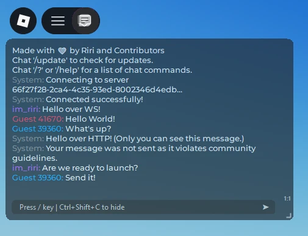
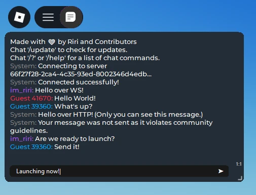

> [!CAUTION]
> The only official place to download Roblox Chat Launcher is [this GitHub repository](https://github.com/AlinaWan/RobloxChatLauncher). Any other websites offering downloads or claiming to be us are not owned by us.

> [!WARNING]
> Roblox Chat Launcher is looking for developers and contributors fluent in C#, JavaScript, and Luau to help improve and maintain the ecosystem.

> [!WARNING]
> Roblox Chat Launcher is seeking a long-term billing partner to cover hosting costs and API costs.

<p align="center">
    
    
</p>

<!--
<div align="center">
  <h1>Roblox Chat Launcher</h1>
</div>
-->

<div align="center">
  
[](LICENSE)
[](https://github.com/AlinaWan/RobloxChatLauncher/releases/latest)
[](CONTRIBUTING.md)
[](#)
[](#)
[](#)
[](#)
[](#)

</div>

<div align="center">

[](https://discord.gg/mhe2bX3dtH)
[](https://github.com/AlinaWan/RobloxChatLauncher/stargazers)
[](https://github.com/AlinaWan/RobloxChatLauncher/releases)

</div>

<!-- START CI GENERATED LOCALIZATION STATUS TABLE; DO NOT REMOVE COMMENT -->

<div align="center">

| Language | Status |
| :--- | :---: |
| **en** |  |
| **zh-Hans** |  |

</div>

<!-- END CI GENERATED LOCALIZATION STATUS TABLE; DO NOT REMOVE COMMENT -->

----

A **secure**, lightweight launcher designed to restore in-game communication and bring back the **co-op gameplay** Roblox removed behind facial and ID verification.

<p>&nbsp;</p>

<!-- Preview images start -->
<p align="center">
  
  
</p>
<!-- Preview images end -->

<p>&nbsp;</p>

<div align="center">
  <h2>Why?</h2>
</div>

Roblox has completely removed in-game communication unless users provide pictures of their face or government IDs—sensitive information that becomes (and has already became) a major security liability in the event of a data breach. While Roblox claims to "immediately" delete this data after processing it, security researchers have exposed that Persona performs up to 269 distinct checks far beyond simple age estimation, including extensive facial recognition against watchlists and financial reporting integrations without the user's consent or knowledge. While these shady practices and ties to controversial investors [led Discord to terminate its partnership with Persona](https://arstechnica.com/tech-policy/2026/02/discord-and-persona-end-partnership-after-shady-uk-age-test-sparks-outcry/), Roblox maintains their partnership.

Even after submitting your biometric data to Roblox and Persona, the new age-segregation policy fragments the player base and ruins the cooperative experience. Roblox Chat Launcher restores this lost social layer with a lightweight Windows overlay that mirrors the native chat experience. By using your keyboard's existing muscle memory and synchronizing directly with the Roblox window, it provides a secure, native-feeling alternative that keeps communication open and co-op gameplay intact without the privacy risks.

Roblox Chat Launcher is only supported for PCs running Windows.

## 📋 Features

* 💬 **Real-time chat** with other players in your Roblox server
* ⌨️ **Seamless integration** feels like native roblox
   * Pressing `/` and `Enter` is captured and lets you type like native chat
   * Synchronizes state with the Roblox window
* 🚀 Compatible with your favorite **Roblox bootstrappers**
   * Bloxstrap
   * Fishstrap
   * Voidstrap
   * *& more!*
* 🚫 Absolutely **no Roblox injection** or memory modification
* 🖥️ Server-side **moderation**, rate limiting, and queue management

## ❓ Frequently Asked Questions

**Q: Is this malware?**

   * **A:** No. The source code here is viewable to all, and it'd be impossible for us to slip anything malicious into the downloads without anyone noticing. Just be sure you're downloading it from [this GitHub repository](https://github.com/AlinaWan/RobloxChatLauncher).

      * **Want to be 100% sure?** Every release is cryptographically signed and attested. You can verify that the `.exe` you downloaded exactly matches the code in this repo by following the [Verification Guide](#trust--provenance).

**Q: Can using this get me banned?**

   * **A:** No, it shouldn't. Like other bootstrappers, Roblox Chat Launcher doesn't interact with the Roblox client in the same way that exploits do. Think of the chat window like using a messaging app like Discord, only seamlessly integrated with the native Roblox experience.

## 💬 Why Not Just Use Discord?

The most common objection is: "But both people need to download this to talk—why not just use Discord?" While Discord is great for pre-planned groups, it fails the spontaneous player. This launcher isn't just a Discord alternative; it’s a native-feel bypass that solves the "Stranger Friction" Discord can't touch.

1. **Zero-Friction Connection**  
On Discord, you need to stop playing, find a Discord server for the game, hope your teammates are in it, and hope that they are online.

   **The Launcher Way:** Roblox Chat Launcher automatically puts you in a channel with everyone else in your game who has the app. No links, no multiple servers, no friction. You just join the game and start typing, and people in your Roblox server see your messages in real time.
   
2. **Context-Aware Intelligence**  
Discord channels are an everything chat for the entire game's community. Roblox Chat Launcher is a precision tool for the server you are currently playing in.

   **Automatic Filtering:** You only hear from people in your specific server. When you hop to a new game, the chat channel hops with you. You never have to manually switch servers or filter out conversations about how to use the WASD keys to keep up with your current teammates.

3. **Integrated "Native" Ergonomics**  
Using Discord involves a clunky overlay or constant Alt-Tabbing, which is heavy, eats memory, and can cause Roblox to lag.

   **Seamless Input:** This launcher mirrors the native Roblox experience and is lightweight and performance-oriented. Pressing `/` to chat and `Enter` to send works exactly like the original chat.

## 🌐 Installing

Download the [latest release of Roblox Chat Launcher](https://github.com/AlinaWan/RobloxChatLauncher/releases), and run the installer. After installation, launching a game will automatically launch the chat window alongside it.

You will also need the [.NET 10.0 Desktop Runtime](https://dotnet.microsoft.com/en-us/download/dotnet/10.0/runtime). If you don't already have it installed, you'll be prompted to install it anyway. Be sure to install Roblox Chat Launcher after you've installed this.

It's not unlikely that Windows Smartscreen will show a popup when you run Roblox Chat Launcher for the first time. This happens because it's an unknown program, not because it's actually detected as being malicious. To dismiss it, just click on "More info" and then "Run anyway".

### Updates

Roblox Chat Launcher will automatically check for updates when you launch it, and prompt you to install the latest version if you're running an outdated one.

### Uninstalling

Roblox Chat Launcher can be easily uninstalled through the `Add or remove programs` menu and will automatically restore your original Roblox client or bootstrapper as the default app.

## Trust & Provenance

To ensure the installer hasn't been tampered with, every release is signed using both **Sigstore** and **GitHub Artifact Attestations**.

### Verify with GitHub CLI

If you have the GitHub CLI installed:

```powershell
gh attestation verify RobloxChatLauncherInstaller.exe --repo AlinaWan/RobloxChatLauncher
```

### Verify with Cosign

If you prefer Cosign, download the `.exe` and the `.cosign.bundle` from the release page:

```powershell
cosign verify-blob RobloxChatLauncherInstaller.exe --bundle RobloxChatLauncherInstaller.exe.cosign.bundle --certificate-identity-regexp "https://github.com/AlinaWan/RobloxChatLauncher/" --certificate-oidc-issuer https://token.actions.githubusercontent.com
```

## Terms of Service

By using Roblox Chat Launcher, you agree to the [Terms of Service](TERMS). Please read them carefully before using the Software.

## Privacy Policy

This project takes steps to protect your privacy and limit data collection. We do not, and are not interested in, selling, sharing, or profiting from your data.

See the [Privacy Policy](PRIVACY) for more details.

## License

This project is licensed under the [GNU General Public License v3.0](LICENSE).

Integration scripts under [this directory](integrations/) are licensed under the [Mozilla Public License 2.0](integrations/LICENSE).

## Acknowledgements

This README is based on the template by [Bloxstrap](https://github.com/bloxstraplabs/bloxstrap/blob/9a062367f78b2e5e48ff53d233c001536978230e/README.md), used under the [MIT License](https://github.com/bloxstraplabs/bloxstrap/blob/9a062367f78b2e5e48ff53d233c001536978230e/LICENSE). It has been modified to fit the specific needs of this project.

Original Copyright (c) 2022 pizzaboxer

The bug report template is based on the one by the [.NET Foundation](https://github.com/dotnet/runtime/blob/f76457846ba599745dfd84705ca81730bfb3ec80/.github/ISSUE_TEMPLATE/01_bug_report.yml), used under the [MIT License](https://github.com/dotnet/runtime/blob/f76457846ba599745dfd84705ca81730bfb3ec80/LICENSE.TXT). It has been modified to fit the specific needs of this project.

Original Copyright (c) .NET Foundation and Contributors

---

**Trademark Notice:** "Roblox" is a registered trademark of Roblox Corporation. This project is not, and makes no claims to be, affiliated with or endorsed by Roblox Corporation.

<div align="center">

[](mailto:RobloxChatLauncher@proton.me)
[](https://robloxchatlauncher.onrender.com/api-docs)
[](https://discord.gg/mhe2bX3dtH)
[](https://www.reddit.com/r/RobloxChatLauncher/)
[](https://twitter.com/RBXChatLauncher)
<!-- These are official accounts on other platforms, but they are either less maintained or need a volunteer account manager -->
<!-- [](https://opencollective.com/robloxchatlauncher) -->
<!-- [](https://tiktok.com/@robloxchatlauncher) -->
<!-- [](https://linkedin.com/in/robloxchatlauncher) -->
<!-- [](https://linktr.ee/RobloxChatLauncher) -->
<!-- [](discord://-/users/1492710394677039225) -->
<!-- [](https://www.reddit.com/user/RobloxChatLauncher/) -->

</div>
